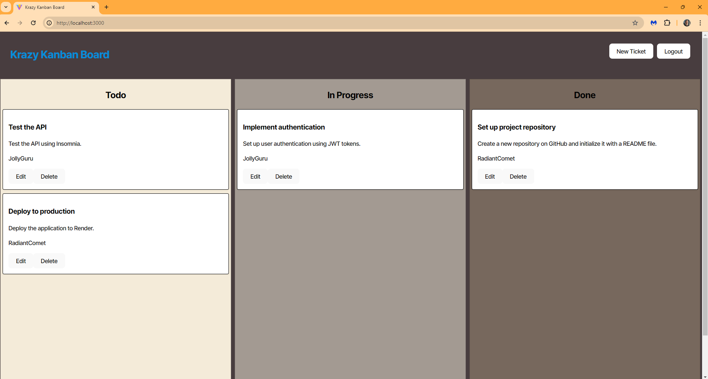

# 14 Full-Stack React: Kanban Board

 
  
  ## Description

 A Kanban Board application for sorting tasks into various levels of priority/completeness.

 ## Deployed Website
 [Visit this link!](https://kanban-board1-wb3p.onrender.com/)

## Mock-Up

The following images show the web application's appearance and functionality:

 ## Table of Contents

  - [Installation](#installation)
  - [Usage](#usage)
  - [License](#license)
  - [Contributing](#contributing)
  - [Tests](#tests)
  - [Questions](#questions)

 ## Installation

 Clone down the repository and open it in VS Code.

 ## Usage

Use npm install to set up the necessary dependencies:
- Open the integrated terminal.
- You will need to use 'npm i' without the quotes.

Run it:
- Type npm run seed
- Type npm run start

## OR

Just visit the website linked above.

 ## License

 This project utilizes an MIT License.
    For more details please go to: [https://choosealicense.com/licenses/mit/](https://choosealicense.com/licenses/mit/) 

 ## Contributing

- Ariel Schilling
- ChatGPT, my pair coder and best friend
- edX Boot Camps LLC, responsible for starter code

 ## Tests

 No tests at this time.
 
 ## Questions

  Please contact the following with any questions you may have:
 - GitHub: https://github.com/raschill
 - Email: rebeccaaschilling@gmail.com
